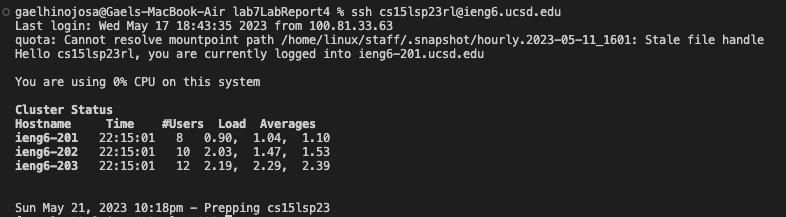
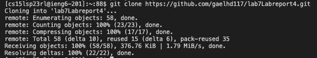
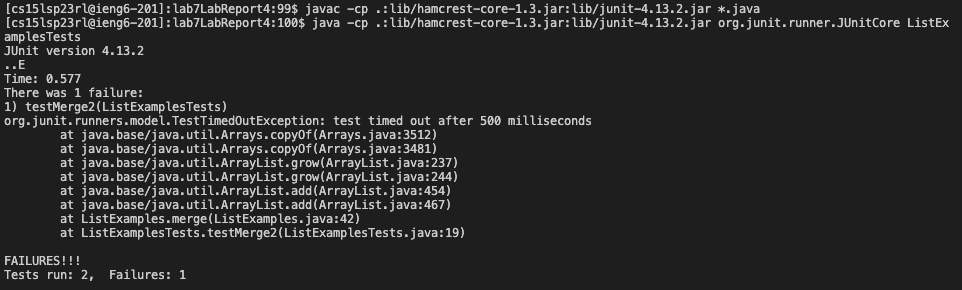
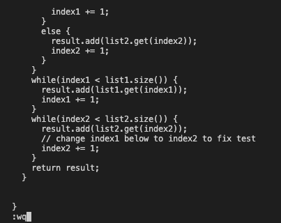
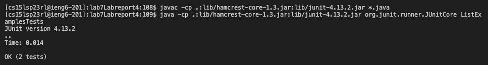
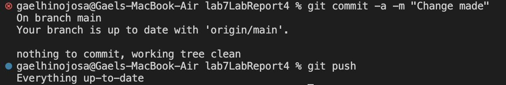

# Lab Report 4

Here are Steps 4-9 from the Timing Task and Baseline

## Step 4

- After doing the previous three steps, I logged into ieng6 and I typed in ssh cs15lsp23@ieng6.ucsd.edu in the terminal and typed in my password

## Step 5

- After logging into ieng6, I then proceeded to clone my forked repository using git clone and the HTTPS url in GitHub
- Here is the code that I used for it:
  git clone https://github.com/gaelhd117/lab7LabReport4
  
  
## Step 6

- After cloning my forked repository, I ran the tests using the Testing tool in VSCode which revealed there was an issue in the third while loop in ListExamples.java
- Here is are the keys I pressed to run the tests (I had used the command previously: <**up**>, <**up**>, <**up**>, <**up**>, <**up**>, <**up**>, <**up**>, <**enter**>, (javac -cp .:lib/hamcrest-core-1.3.jar:lib/junit-4.13.2.jar *.java). Then repeated <**up**>, <**up**>, <**up**>, <**up**>, <**up**>, <**up**>, <**enter**>, (java -cp .:lib/hamcrest-core-1.3.jar:lib/junit-4.13.2.jar org.junit.runner.JUnitCore ListExamplesTests)

- The first time I did this no keys were pressed instead I just clicked on Testing, then went on Run Test (I believe this is the wrong way to do it but I am putting it here just to be safe)
  
  
## Step 7
  

 - Once I showed that there was a problem with the code in ListExamples.java, I edited the code in ListExamples.java, all I needed to do was change the index2 and change it to index 1 and then save the changes made: index1 += 1; 
 - Here are the keys I pressed for this: <**4**>, <**3**>, <**j**>, <**e**>, <**x**>, <**i**>, <**2**>, <**esc**>, <**:**>, <**w**>, <**q**>, <**enter**>

- <**43j**> essentially repeats the down key 43 times
- <**e**> just goes to the end of the next word
- <**x**> deletes the character that the cursor is on
- <**i**> lets me type out what I want
- <**:wq**> saves and exits out of vim

## Step 8
  

  
- With changes saved I repeated Step 6 and demonstrated that the test now passed
- Here is are the keys I pressed to run the tests (I had used the command previously: <**up**>, <**up**>, <**up**>, <**up**>, <**up**>, <**up**>, <**up**>, <**enter**>, (javac -cp .:lib/hamcrest-core-1.3.jar:lib/junit-4.13.2.jar *.java). Then repeated <**up**>, <**up**>, <**up**>, <**up**>, <**up**>, <**up**>, <**enter**>, (java -cp .:lib/hamcrest-core-1.3.jar:lib/junit-4.13.2.jar org.junit.runner.JUnitCore ListExamplesTests)

- Originally did the same thing as Step 6, I just clicked on Testing, then went on Run Test
  
## Step 9

- After changing the code I then used git commit and git push to save the changes into my GitHub account
Here are the keys I entered: git commit -a -m "Change made", git push 
